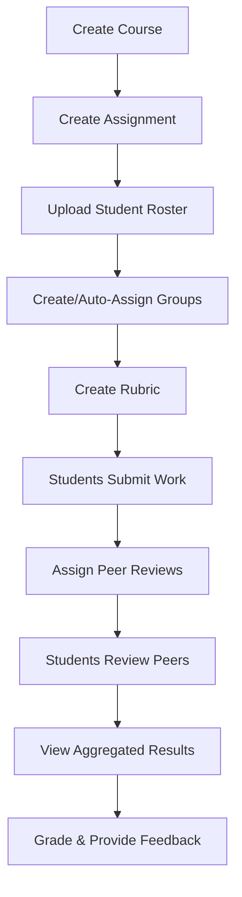
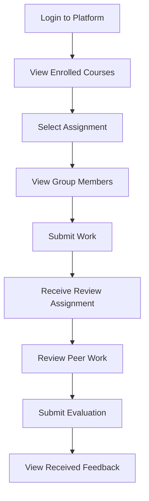

# Architecture Overview

## What is the Peer Evaluation App?

The Peer Evaluation App is an academic platform that enables **structured peer review and group evaluation** in educational settings. It allows instructors to create courses and assignments, organize students into groups, and facilitate anonymous peer evaluations using customizable rubrics.

### The Problem It Solves

In collaborative academic projects:
- **Instructors** struggle to assess individual contributions within group work
- **Students** need fair recognition for their efforts in team settings
- **Grading** becomes subjective without structured evaluation criteria
- **Accountability** suffers when individual contributions are unclear

This app provides a systematic, transparent way to evaluate peer contributions while maintaining anonymity and fairness.

---

## Core Concepts

### 1. **Users & Roles**

The system has three role types with hierarchical permissions:

```
┌─────────────────────────────────────────┐
│              ADMIN                      │
│  • Create teacher/admin accounts        │
│  • Manage all users                     │
│  • System-wide administration           │
└───────────────┬─────────────────────────┘
                │
┌───────────────▼─────────────────────────┐
│             TEACHER                     │
│  • Create courses & assignments         │
│  • Upload student rosters               │
│  • Create/manage groups                 │
│  • View all student work                │
└───────────────┬─────────────────────────┘
                │
┌───────────────▼─────────────────────────┐
│            STUDENT                      │
│  • Enroll in courses                    │
│  • Submit assignments                   │
│  • Peer review classmates               │
│  • View own feedback                    │
└─────────────────────────────────────────┘
```

### 2. **Courses**

- Created by teachers
- Contains multiple assignments
- Students enroll to gain access
- Scoped to a specific academic term/semester

### 3. **Assignments**

- Belong to a specific course
- Have due dates and submission requirements
- Can have associated rubrics for evaluation
- May be individual or group-based
- Teachers can enable/disable individual reviews and group reviews per assignment
- Can be set as anonymous (hides reviewer identity from students)

### 4. **Groups**

- Course-level student groupings
- Students remain in the same group for all assignments in a course
- Enable peer evaluation within teams
- Can be created manually or via roster upload
- Students see only their group members' work

### 5. **Rubrics**

- Define evaluation criteria for assignments
- Created by teachers
- Contain multiple criteria/questions
- Each criterion can be scored or comment-only
- Two rubric types per assignment: **individual** (for peer reviews) and **group** (for group-to-group reviews)
- Provide consistent evaluation standards

### 6. **Reviews**

- Two review types: **individual** (student reviews a peer within their group) and **group** (a group collectively reviews another group)
- Anonymous to protect reviewer identity
- Scoped to specific assignments
- Structured by rubric criteria
- Include scores per criterion and an overall qualitative comment
- Individual reviews: submitted and editable by the reviewer
- Group reviews: any group member can submit on behalf of the group; all members can view and edit
- Course grade = 50% individual average + 50% group average (weighted)

---

## User Workflows

### Instructor Workflow



**Detailed Steps:**

1. **Create Course** - Set up a new class (e.g., "COSC 470 Fall 2025")
2. **Create Assignment** - Define project requirements and due dates
3. **Upload Roster** - CSV upload creates student accounts and enrolls them
4. **Organize Groups** - Manual assignment or automatic grouping
5. **Create Rubric** - Define evaluation criteria (e.g., "Code Quality", "Communication", "Effort")
6. **Monitor Submissions** - Track who has submitted work
7. **Assign Reviews** - Decide who reviews whom (can be within groups or cross-group)
8. **Review Analytics** - See completion rates and scores
9. **Grade** - Combine peer feedback with instructor assessment

### Student Workflow



**Detailed Steps:**

1. **Login** - Use credentials (provided by teacher or self-registration)
2. **Navigate to Course** - Access enrolled courses from dashboard
3. **View Assignment Details** - Read requirements, due dates, rubric
4. **Check Group** - See who you're working with
5. **Submit Work** - Upload submission or link to work
6. **Receive Peer Review Task** - Get notified of peers to evaluate
7. **Evaluate Peers** - Fill out rubric for assigned classmates (anonymous)
8. **View Feedback** - After review period, see what peers said about your work

---

## Data Flow Example

Let's trace a complete peer evaluation cycle:

### Setup Phase
```
Teacher creates:
  Course: "Software Engineering Fall 2025"
    ├── Assignment: "Group Project Sprint 1"
    ├── Rubric: [Code Quality, Communication, Effort]
    └── Groups: [Group A, Group B, Group C]

Students enrolled:
  Group A: Alice, Bob, Carol
  Group B: David, Emma, Frank
```

### Submission Phase
```
Students submit work:
  Alice ──→ Submission #1 (Group A work)
  Bob   ──→ Submission #2 (Group A work)
  Carol ──→ Submission #3 (Group A work)
  [etc. for Groups B and C]
```

### Individual Review Phase
```
Within Group A (using the individual rubric):
  Alice reviews → Bob & Carol
  Bob reviews   → Alice & Carol
  Carol reviews → Alice & Bob

Each individual review contains:
  ├── Overall Comment: "Great team player, very collaborative"
  ├── Criterion 1 (Code Quality):     Score: 4/5
  ├── Criterion 2 (Communication):    Score: 5/5
  └── Criterion 3 (Effort):           Score: 3/5
```

### Group Review Phase
```
Groups review other groups (using the group rubric):
  Group A reviews → Group B, Group C
  Group B reviews → Group A, Group C
  Group C reviews → Group A, Group B

Any member can submit on behalf of their group.
All group members can view and edit submitted group reviews.

Each group review contains:
  ├── Overall Comment: "Solid presentation and teamwork"
  ├── Criterion 1 (Collaboration):    Score: 8/10
  └── Criterion 2 (Presentation):     Score: 7/10
```

### Analysis Phase
```
System aggregates for Alice (via GET /review/course/<courseId>/summary):

  Individual reviews received from: Bob, Carol
    Bob's review:   4 + 5 + 3 = 12
    Carol's review: 5 + 4 + 5 = 14
    Individual average: (12 + 14) / 2 = 13.0 / 15

  Group reviews received by Group A from: Group B, Group C
    Group B's review: 8 + 7 = 15
    Group C's review: 9 + 8 = 17
    Group average: (15 + 17) / 2 = 16.0 / 20

  Course average: 50% individual + 50% group (weighted)

Teacher views (same endpoint, sees all students):
  ├── Individual student scores (?studentID=X)
  ├── Aggregate scores across all reviews
  ├── Per-assignment breakdowns (individual + group counts)
  └── Weighted course average
```

### Gradebook Phase (Teacher)
```
Teacher opens Gradebook tab (GET /gradebook/course/<courseId>):
  Returns all students × all assignments with computed grades

  For each student × assignment cell:
    ├── individualAverage / individualMax (from peer reviews)
    ├── groupAverage / groupMax (from group reviews)
    ├── overrideScore (teacher manual override, if set)
    ├── effectiveGrade = overrideScore ?? (individualAvg + groupAvg)
    └── effectiveMax = max possible from rubric criteria

  Teacher actions:
    ├── Click grade → inline edit → PUT /gradebook/course/<id>/override
    ├── Clear override → DELETE /gradebook/course/<id>/override
    └── Click eye icon → modal shows all reviews (individual + group)

  Grade overrides are stored separately (GradeOverride table),
  never overwriting the underlying peer review data.
```

---

## System Architecture

### High-Level Components

```
┌──────────────────────────────────────────────┐
│           Web Browser (Client)               │
│  React SPA with React Router                 │
└──────────────┬───────────────────────────────┘
               │ HTTP/REST + JWT Cookies
               │
┌──────────────▼───────────────────────────────┐
│        Flask Backend (REST API)              │
│  ┌────────────────────────────────────────┐  │
│  │  Controllers (Blueprints)              │  │
│  │  ├── /auth  (login, register, logout) │  │
│  │  ├── /user  (profile management)      │  │
│  │  ├── /class (course management)       │  │
│  │  ├── /assignment (CRUD operations)    │  │
│  │  ├── /assignment-resource (file mgmt) │  │
│  │  ├── /groups (course-level groups)    │  │
│  │  ├── /rubric (evaluation criteria)    │  │
│  │  ├── /submission (student uploads)    │  │
│  │  ├── /gradebook (teacher gradebook)  │  │
│  │  └── /admin (user administration)     │  │
│  └─────────────────┬──────────────────────┘  │
│                    │                          │
│  ┌─────────────────▼──────────────────────┐  │
│  │  Business Logic Layer                  │  │
│  │  ├── Services (reusable logic)         │  │
│  │  │   ├── grade_service (calculations)  │  │
│  │  │   ├── progress_service (tracking)   │  │
│  │  │   ├── review_masking (anonymity)    │  │
│  │  │   ├── review_tracking               │  │
│  │  │   └── group_service (group utils)   │  │
│  │  ├── JWT Authentication               │  │
│  │  ├── Role-Based Authorization         │  │
│  │  └── Data Validation (Marshmallow)    │  │
│  └─────────────────┬──────────────────────┘  │
│                    │                          │
│  ┌─────────────────▼──────────────────────┐  │
│  │  Data Access Layer (SQLAlchemy ORM)   │  │
│  │  ├── User Model                       │  │
│  │  ├── Course / User_Course Models      │  │
│  │  ├── Assignment Model                 │  │
│  │  ├── AssignmentResource Model         │  │
│  │  ├── Submission Model                 │  │
│  │  ├── Group Models (CourseGroup, etc.) │  │
│  │  ├── Rubric/CriteriaDescription       │  │
│  │  ├── Review/Criterion Models          │  │
│  │  └── GradeOverride Model             │  │
│  └─────────────────┬──────────────────────┘  │
└────────────────────┼────────────────────────┘
                     │ SQL Queries
                     │
┌────────────────────▼────────────────────────┐
│       Relational Database                   │
│  SQLite (dev) / PostgreSQL (production)     │
└─────────────────────────────────────────────┘
```

### Key Design Principles

**Separation of Concerns:**
- **Controllers** handle HTTP requests/responses, delegating to business logic
- **Services** encapsulate complex, reusable business logic (grade calculations, progress tracking, anonymity masking) for code modularity and testability
- **Models** encapsulate data and database operations
- **Schemas** validate and serialize data between layers

**RESTful API:**
- Stateless design (JWT for authentication)
- Standard HTTP methods (GET, POST, PUT, DELETE)
- JSON for data exchange
- HTTPOnly cookies for secure token storage

**Role-Based Access Control:**
- Enforced at the controller level via decorators
- Database stores role with user record
- Permissions checked before any protected operation

---

## Authentication & Security Flow

```
┌─────────────┐
│  Frontend   │
└──────┬──────┘
       │
       │ 1. POST /auth/login {email, password}
       │
┌──────▼──────────────────────────────────┐
│  Backend                                │
│  ├─ Validate credentials                │
│  ├─ Generate JWT token                  │
│  ├─ Set HTTPOnly cookie                 │
│  └─ Return user info {role, id, name}   │
└──────┬──────────────────────────────────┘
       │
       │ 2. Frontend stores role in memory
       │    Browser stores JWT in HTTPOnly cookie
       │
┌──────▼──────┐
│  Frontend   │ 3. For protected routes:
└──────┬──────┘    GET /user/profile
       │           (credentials: 'include')
       │
┌──────▼──────────────────────────────────┐
│  Backend                                │
│  ├─ Read JWT from cookie                │
│  ├─ Verify signature & expiration       │
│  ├─ Extract user identity                │
│  ├─ Check role permissions              │
│  └─ Execute request or return 401/403   │
└─────────────────────────────────────────┘
```

**Security Features:**
- JWT tokens in HTTPOnly cookies (not accessible to JavaScript)
- CSRF protection in production
- Password hashing (Werkzeug SHA-256)
- Role-based endpoint protection
- Secure cookie flags in production (HTTPS-only, SameSite)

---

## Database Relationships

```
User ──────────┬──── Course (as teacher)
               │
               ├──── User_Course (enrollment)
               │
               ├──── Group_Members (group membership)
               │
               ├──── Submission (work submitted)
               │
               └──── Review (as reviewer; as reviewee for individual reviews)

Course ────────┼──── Assignment
               │
               ├──── CourseGroup (groups are course-level)
               │
               └──── User_Course (enrollments)

Assignment ────┼──── AssignmentResource (teacher uploads)
               │
               ├──── Submission (student work)
               │
               ├──── Review (peer evaluations — individual & group)
               │
               └──── Rubric (individual rubric + group rubric)

Rubric ────────┼──── Criteria_Description (rubric rows)

Review ────────┼──── Criterion (filled-in rubric responses)
               │
               ├──── Reviewer → User (who submitted)
               │
               └──── Reviewee → User (individual) or CourseGroup (group)
                     (polymorphic, based on review_type)

CourseGroup ───┼──── Group_Members (who's in this group)
               │
               └──── Review (as reviewee for group reviews)
```

**Key Relationships:**
- **One-to-Many**: Course → Assignments, Rubric → Criteria, Course → CourseGroups
- **Many-to-Many**: Users ↔ Courses (via User_Course), Users ↔ Groups (via Group_Members)
- **Polymorphic**: Review.revieweeID → User (individual) or CourseGroup (group), determined by review_type

See [database-schema.md](schema/database-schema.md) for complete details.

---

## Technology Stack

| Layer | Technology | Purpose |
|-------|-----------|---------|
| **Frontend** | React 18 + TypeScript | UI components and routing |
| | Vite | Fast dev server and build tool |
| | React Router | Client-side navigation |
| | Tailwind CSS | Utility-first CSS styling |
| **Backend** | Flask 3.x | REST API framework |
| | SQLAlchemy | ORM for database operations |
| | Flask-JWT-Extended | JWT token management |
| | Marshmallow | Data validation and serialization |
| **Database** | SQLite (dev) | Lightweight local development |
| | PostgreSQL (prod) | Production-grade relational DB |
| **Dev Tools** | pytest | Backend testing |
| | GitHub Actions | CI/CD pipelines |
| | Docker | Containerization |

---

## Future Enhancements

Current implementation supports core workflows. Planned features:

- **Advanced Analytics**: Teacher dashboards with visualization
- **Notification System**: Email alerts for deadlines and reviews
- **Rubric Templates**: Reusable evaluation criteria
- **Peer Assignment Algorithms**: Automated fair distribution
- **Grade Calculation**: Weighted scoring formulas
- **Review Endpoints**: Peer review submission and retrieval
- **Mobile Responsive UI**: Improved mobile experience

See [user_stories.md](user_stories.md) for complete feature roadmap.

---

## Next Steps

Now that you understand the architecture:

1. **Explore the Code**: Start with `flask_backend/api/__init__.py` and `frontend/src/App.tsx`
2. **Review API Docs**: See [ENDPOINT_SUMMARY.md](dev-guidelines/ENDPOINT_SUMMARY.md)
3. **Understand Workflows**: Read [CONTRIBUTING.md](CONTRIBUTING.md) for development process
4. **Run Tests**: Check [TESTING.md](TESTING.md) to understand test patterns

---

**Questions about the architecture?** Check other documentation or ask the team!
