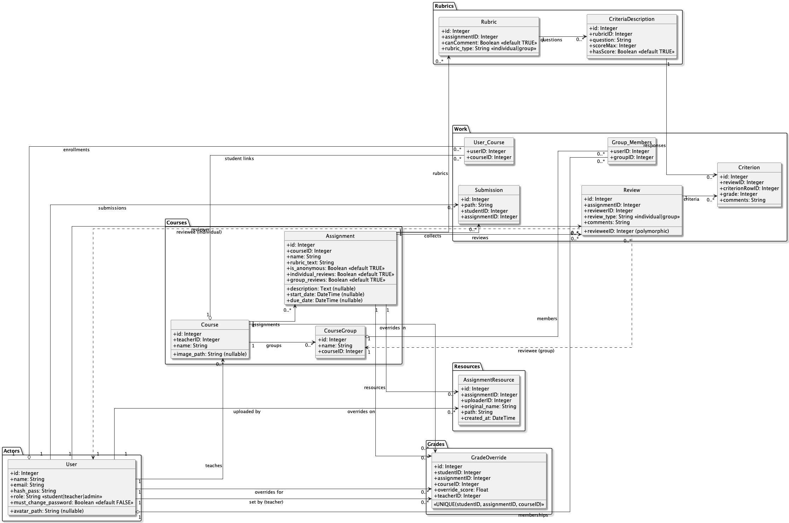

# Database Schema — Peer Evaluation App (ORM Class Diagram)

This document captures the relational schema implemented by the active Flask backend (SQLAlchemy). It mirrors the canonical SQL in `schema.sql` and the SQLAlchemy models in `flask_backend/api/models`. The legacy Node/Fastify backend remains for reference only; do not treat its Sequelize models as the source of truth.

## Source of truth + regeneration

- **Models:** `flask_backend/api/models/*.py` — authoritative field list, constraints, and cascades
- **DDL reference:** `schema.sql` — kept in sync for seed data and CI
- **Diagram:** `docs/schema/database-schema.puml` renders to `database-schema.png`; regenerate after structural changes using the PlantUML CLI or the VS Code PlantUML extension

## PlantUML Diagram (source)

Field types, primary keys, and notable constraints are included for quick reference.

> Note: In `schema.sql`, most foreign key constraints are commented out for local dev and test convenience. The logical relationships above reflect how the application uses these tables.

## Schema Overview

### Users, Courses, and Enrollment

- User
  - id (PK, autoincrement), name (required), email (unique, indexed), hash_pass, role (`student|teacher|admin`, default `student` via DB check constraint), must_change_password (BOOLEAN, default FALSE)
  - Relationships: `teaching_courses`, `user_courses`, `courses` (through `User_Courses`), `submissions`, `reviews_made`, `group_memberships`
- Course
  - id (PK), teacherID (FK -> User.id, not null), name
  - Relationships: `teacher`, `assignments`, `students` (via `User_Courses`), `user_courses`
- User_Courses (enrollment join)
  - PK: (userID, courseID)
  - FKs: userID -> User.id, courseID -> Course.id; used for both students and co-teachers, role derived from `User.role`

### Assignments and Grouping

- Assignment
  - id (PK), courseID (FK -> Course.id), name, `description` (nullable), `start_date` (nullable, timezone-aware), `rubric_text` column (stored as `rubric`), `due_date` (nullable, timezone-aware), `is_anonymous` (BOOLEAN, default TRUE), `individual_reviews` (BOOLEAN, default TRUE), `group_reviews` (BOOLEAN, default TRUE)
  - Relationships: `course`, `rubrics`, `submissions`, `reviews`, `resources`
- CourseGroup
  - id (PK), name, courseID (FK -> Course.id, not null)
  - Groups belong to **courses**, not assignments — students stay in the same group for all assignments in a course
- Group_Members
  - PK: (userID, groupID)
  - Columns: groupID (FK -> CourseGroup.id), userID (FK -> User.id)
  - Represents course-scoped group membership for users

### Assignment Resources

- AssignmentResource
  - id (PK), assignmentID (FK -> Assignment.id, not null), uploaderID (FK -> User.id, not null), original_name (varchar, not null), path (varchar, not null), created_at (TIMESTAMP, auto-set)
  - Teacher-uploaded supporting documents for an assignment (e.g., instructions, rubric PDFs)
  - Relationships: `assignment`, `uploader`

### Submissions

- Submission
  - id (PK), path, studentID (FK -> User.id, not null), assignmentID (FK -> Assignment.id, not null)
  - Stores a file path or blob reference to the submitted artifact

### Reviews, Rubrics, and Criteria

- Review
  - id (PK), assignmentID (FK -> Assignment.id), reviewerID (FK -> User.id), revieweeID (INT, no FK constraint), review_type (VARCHAR(20), NOT NULL, default 'individual'), comments (VARCHAR(500), nullable)
  - Supports two review types: `individual` (revieweeID → User.id) and `group` (revieweeID → CourseGroup.id). The polymorphic `revieweeID` has no foreign-key constraint; resolution is handled in application code.
  - For group reviews, any group member may submit on behalf of the group. Duplicate prevention checks all members of the submitter's group. All group members can view and edit the review.
  - The `comments` field stores the reviewer's overall comment for the entire review
- Rubric
  - id (PK), assignmentID (FK -> Assignment.id), canComment (BOOLEAN NOT NULL DEFAULT TRUE), rubric_type (VARCHAR(20), NOT NULL, default 'individual')
  - Each assignment can have one individual rubric and one group rubric (distinguished by `rubric_type`)
- Criteria_Description (rubric rows)
  - id (PK), rubricID (FK -> Rubric.id), question, scoreMax, hasScore (default TRUE)
  - Defines each question/row shown to reviewers
- Criterion (responses per review per row)
  - id (PK), reviewID (FK -> Review.id), criterionRowID (FK -> Criteria_Description.id), grade, comments
  - Captures the reviewer’s inputs for a single rubric row

### Grade Overrides

- GradeOverride
  - id (PK), studentID (FK -> User.id, indexed), assignmentID (FK -> Assignment.id, indexed), courseID (FK -> Course.id, indexed), override_score (Float, not null), teacherID (FK -> User.id)
  - UniqueConstraint on (studentID, assignmentID, courseID) — one override per student per assignment per course
  - Allows teachers to manually set a grade that takes precedence over peer-review averages in the gradebook
  - Relationships: `student`, `assignment`, `course`, `teacher`

## Constraints and Defaults

- Auto-incrementing integer primary keys for all base tables except the two join tables, which use composite keys
- `User.email` is unique and indexed; `User.role` constrained to (`student`, `teacher`, `admin`)
- `Assignment.due_date` is nullable; when set, application logic blocks edits after the deadline
- `Rubric.canComment` and `Criteria_Description.hasScore` both default to TRUE
- Foreign keys are declared in SQLAlchemy and respected by SQLite/Postgres; many are commented out in `schema.sql` purely to ease local imports

## Alignment With Code

- SQLAlchemy models live in `flask_backend/api/models` and mirror the tables above
- Route handlers under `flask_backend/api/controllers` operate on these models; see `docs/dev-guidelines/ENDPOINT_SUMMARY.md` for API-level interactions
- When adding or editing columns, update both the SQLAlchemy models and `schema.sql`, regenerate the PlantUML diagram, and keep this document in sync

If you update `schema.sql`, please keep this document in sync.
